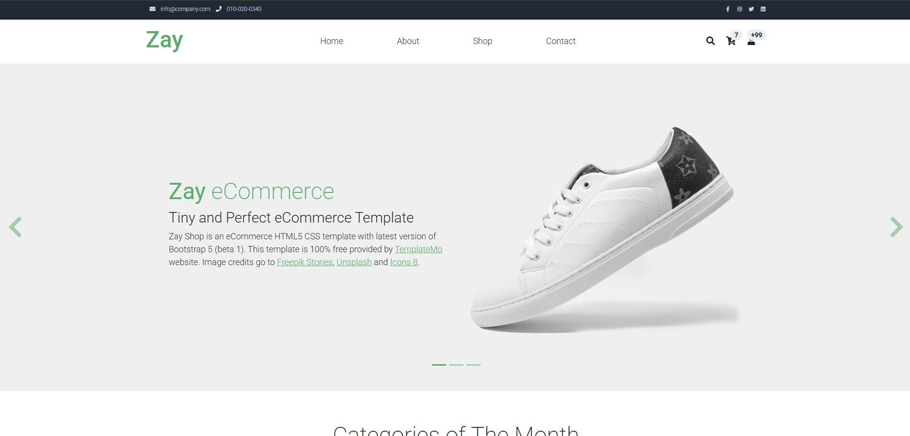
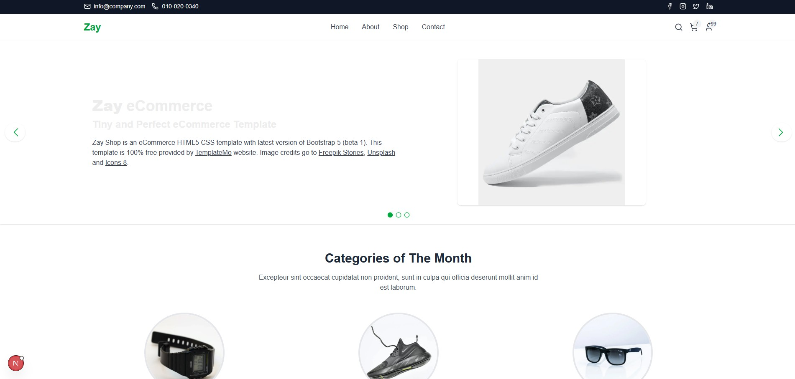

# 🛒 Zay Shop Migration – Case Study  
**From Bootstrap HTML → Next.js + TypeScript + Tailwind CSS**  

This project demonstrates how I migrated the **Zay Shop** template’s `index.html` into a modern **React/TypeScript stack** using **Next.js, Tailwind CSS**.  

The focus of this work was not only technical migration but also **exploring Human–AI collaboration**: using AI as an assistant to accelerate repetitive tasks, while applying human expertise for pixel-perfect fidelity, responsiveness, and design polish.  

---

## 🚀 Project Overview  

- **Migrated Page**: `index.html` (Home page)  
- **Stack**:  
  - Next.js (App Router)  
  - TypeScript  
  - Tailwind CSS  
  - Font Awesome (icons)  
- **Goal**: Take an existing web page template and modernise it into a React/TypeScript front end using Next.js + Tailwind CSS.

--- 

## 📁 Project Structure

```
zay-shop-nextjs/
├── src/
│   ├── app/
│   │   ├── layout.tsx
│   │   ├── page.tsx
│   │   └── globals.css
│   └── components/
│       ├── TopNav.tsx
│       ├── Header.tsx
│       ├── HeroCarousel.tsx
│       ├── CategoriesSection.tsx
│       ├── FeaturedProducts.tsx
│       └── Footer.tsx
├── public/
│   ├── images/
│   └── css/
├── next.config.ts
└── package.json
```

---
## 🧑‍💻 Human with AI – Collaboration Approach  

AI was used to **accelerate boilerplate work**, suggest component structures, and handle repetitive Bootstrap → Tailwind class conversions.  

Humans (me) ensured:  
- Pixel-perfect fidelity  
- Correct responsive layouts  
- Functional fixes (hover, spacing, accessibility)  
- Design polish  

> **Key Insight**: AI speeds up development by handling the repetitive/common tasks, allowing me to focus my **thinking power on complex design and problem-solving**.  

---

## 🤖 AI-Assisted Development Process

### AI Tools Used
- **ChatGPT**, **Gemini**, **Claude**, **GitHub Copilot**, **DeepSeek** , **Cursor** (Free versions)
- Note: As I used free versions of the AI tools I had a lot of limitations mostly related to the context window size and the number of tokens that could be processed. So

---

## 📂 Step-by-Step Migration Process  

### **Step 1: Initial Analysis & Planning**  
- **Prompt**:  
  > "Analyze this HTML template and suggest a component architecture for migrating to Next.js with TypeScript and Tailwind CSS"  
- **Context File**: `index.html`  
- **AI Contribution (Claude)**:  
  - Identified **8 distinct components** needed  
  - Suggested TypeScript interfaces for data models  
  - Recommended a **Next.js App Router structure**  

---

### **Step 2: Project Setup**  
- **Prompt**:  
  > "Set up a Next.js project with TypeScript and Tailwind CSS for migrating an HTML template"  
- **Context File**: `index.html`  
- **AI Contribution (Claude Sonnet 4 in Cursor IDE)**:  
  - Generated **Next.js project scaffold**  
  - Configured **TypeScript + Tailwind**  
  - Set up **import aliases**  

---

### **Step 3: Component Analysis & Breakdown**  
- **Prompt**:  
  > "Analyze this HTML structure and break it down into React components"  
- **Context File**: `index.html`  
- **AI Contribution (Claude Sonnet 4)**:  
  - Suggested **logical component boundaries**  
  - Defined component hierarchy  
  - Proposed **props interfaces** and **state management**  

---

### **Step 4: Bootstrap → Tailwind CSS Conversion**  
- **Prompt**:  
  ```  
  Convert this Bootstrap snippet to Tailwind keeping structure, colors, and sizes identical:  
  '<div class="container mx-auto px-4 py-2">example</div>'  
  ```  
- **AI Contribution (ChatGPT, DeepSeek)**:  
  - Converted **grids, spacing, typography, colors**  
  - Maintained **responsiveness and transitions**  
- **Human Fixes**:  
  - Many classes were not directly mapped → manually refined for **pixel-perfect migration**  

---

### **Step 5: Image Optimization**  
- **Prompt**:  
  > "Set up image optimization and placeholder images"  
- **AI Contribution (ChatGPT, Gemini, DeepSeek)**:  
  - Configured **Next.js `<Image />`** component  
  - Set up external image domains  
  - Implemented **responsive loading**  
- **Human Fixes**:  
  - Adjusted **aspect ratios, placeholders, and lazy loading**  

---

### **Step 6: Bug Fixing**  
- **Prompt**:  
  > "In footer.tsx social media logo border is too bold, and hover effect not working properly. Use index.html as reference"  
- **Context File**: `footer.tsx`, `index.html`  
- **AI Contribution (Claude Sonnet 4, Gemini)**:  
  - Suggested CSS fixes for border and hover  
- **Human Fixes**:  
  - Refined hover transitions and colors using Tailwind  

---

### **Step 7: Mobile Responsiveness**  
- **Prompt**:  
  > "Product card mobile response doesn't have spaces of card properly, use index.html as reference"  
- **Context File**: `featuredproduct.tsx`, `index.html`  
- **AI Contribution (ChatGPT, Gemini, Claude)**:  
  - Adjusted grid system and spacing  
- **Human Fixes**:  
  - Verified spacing across **all breakpoints**  
  - Ensured **mobile-first responsiveness**  

---

### **Step 8: Manual Fixes**  
- Final **human refinements**:  
  - Verified color palette against original design  
  - Fixed Tailwind class gaps for layout accuracy  
  - Tweaked font weights and alignment  
  - Integrated **Font Awesome icons** for full fidelity  

---


## 🚀 Getting Started

```bash
git clone https://github.com/AJakif/modern-zay-shop-with-ai
cd zay-shop-nextjs/modern-zay-shop-with-ai
npm install
npm run dev
```

### Available Scripts
```bash
npm run dev
npm run build
npm run start
npm run lint
```

---

## 🖼 Visual Proof / Screenshots

> **Before (Original Zay Shop)**  
>   

> **After (Migrated React/Next.js Version)**  
>   

---

## 🎯 Challenges and Learnings  

1. **Bootstrap → Tailwind Migration**  
   - AI successfully converted many grids, spacing, and typography classes.
   - However, **not every Bootstrap class mapped directly to Tailwind**, requiring manual inspection and adjustment. 
   - Developers fine-tuned dozens of classes to achieve **layout fidelity and pixel-perfection**. 

2. **Carousel Implementation**  
   - AI provided the base structure and state logic. 
   - Manual work was required for **ARIA accessibility, smooth transitions, and responsive behavior**.

3. **Image Handling**  
   - AI helped with **Next.js Image optimization and placeholder setup**. 
   - Human tuning was necessary to maintain **correct aspect ratios, responsive sizing, and placeholder quality**.  

4. **Pixel-Perfect Migration**
   - AI alone achieved **~70% accuracy in visual fidelity(only for the most common classes)**.
   - Final polish depended on **human judgment for typography, spacing, hover effects, and brand consistency**.

5. **Human + AI Collaboration**
   - AI was most effective for **scaffolding, repetitive class conversions, and boilerplate setup**.
   - Human developers focused on **creative decisions, QA, responsiveness, and ensuring design accuracy**.
   - Overall, AI accelerated work by **saving 50%+ of development time**, allowing developers to dedicate more effort to **complex reasoning and fine-tuning**.

---

## ✅ Deliverables  

- A **working GitHub project** (Next.js + TypeScript + Tailwind + Font Awesome)  
- This **README case study** covering:  
  - Migrated page (`index.html`)  
  - How AI was used (with prompts + context files)  
  - Key challenges and learnings  
- Screenshots of the **migration process and results**  

---

## 🤝 Human + AI Contribution  

| Task                         | AI Contribution                                      | Human Contribution                                |
|-------------------------------|------------------------------------------------------|--------------------------------------------------|
| **Initial Planning**          | ✅ Suggested component architecture & Next.js structure | Decided which parts to keep, adjusted architecture |
| **Project Setup**             | ✅ Generated Next.js + TS + Tailwind scaffold           | Verified configs, ensured build worked            |
| **Component Breakdown**       | ✅ Proposed boundaries, props, and hierarchy            | Refined interfaces, handled edge cases            |
| **Bootstrap → Tailwind**      | ✅ Converted grids, spacing, colors, typography         | Fixed missing classes, ensured **pixel-perfect** layout |
| **Image Optimization**        | ✅ Set up Next.js Image with responsive loading         | Tuned aspect ratios, added placeholders           |
| **Bug Fixing**                | ✅ Suggested hover/border fixes                         | Finalized transitions, corrected inconsistencies  |
| **Mobile Responsiveness**     | ✅ Suggested grid/spacing adjustments                   | Verified across devices, polished responsiveness  |
| **Final QA & Polish**         | ❌Limited                                              | Ensured design fidelity, accessibility, icons     |

---

🔑 **Final Takeaway**:  
AI alone cannot deliver a **100% pixel-perfect migration**.  
But **Human with AI** collaboration leads to faster, more efficient workflows—where AI accelerates the repetitive work, and humans focus on the **critical thinking, creative design, and fine-tuning**.  
