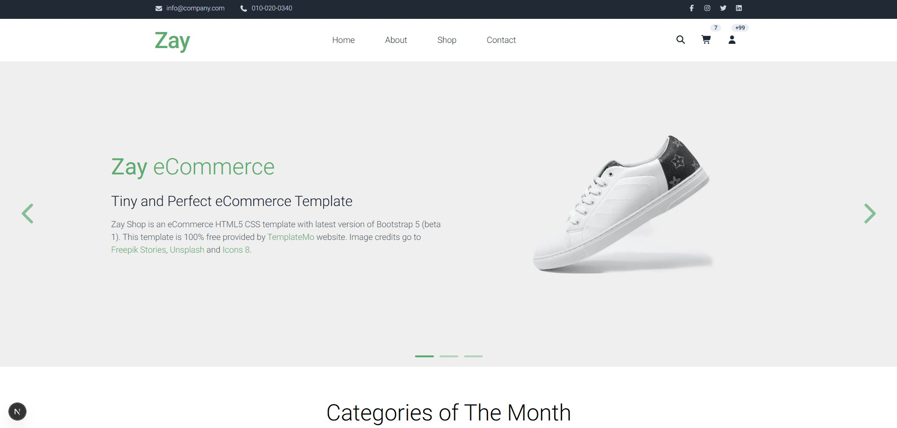

# Zay Shop - Modern eCommerce Template Migration

A modern React/TypeScript frontend migration of the **Zay Shop** eCommerce template, built with **Next.js** and **Tailwind CSS**.

## 🎯 Project Overview

This project demonstrates the migration of a traditional HTML/CSS/Bootstrap template to a modern React-based application using Next.js, TypeScript, and Tailwind CSS. The original template was sourced from [TemplateMo's Zay Shop](https://templatemo.com/live/templatemo_559_zay_shop).

The goal was to modernize the UI, preserve functionality, and leverage AI-assisted development to accelerate the migration.

## 🚀 Tech Stack

- **Framework**: Next.js 15 (App Router)  
- **Language**: TypeScript  
- **Styling**: Tailwind CSS  
- **Icons**: Lucide React & Heroicons  
- **Image Optimization**: Next.js Image component  
- **Development Tools**: ESLint, TypeScript compiler  

## 📁 Project Structure

```
zay-shop-nextjs/
├── src/
│   ├── app/
│   │   ├── layout.tsx
│   │   ├── page.tsx
│   │   └── globals.css
│   └── components/
│       ├── TopNav.tsx
│       ├── Header.tsx
│       ├── HeroCarousel.tsx
│       ├── CategoriesSection.tsx
│       ├── FeaturedProducts.tsx
│       └── Footer.tsx
├── public/
│   ├── images/
│   └── css/
├── next.config.ts
└── package.json
```
---

## 🤖 AI-Assisted Development Process

### AI Tools Used
- **ChatGPT**, **Gemini**, **Claude**, **GitHub Copilot**, **DeepSeek**  

### Key AI Contributions
- **Project Setup:** Scaffolded Next.js + TypeScript + Tailwind project  
- **Component Breakdown:** Suggested modular component structure  
- **Bootstrap → Tailwind Conversion:** Converted many grids, spacing, colors, typography classes  
- **Interactive Features:** Assisted with state management for carousel and cart  
- **Image Optimization:** Configured Next.js Image for responsive loading  

### Key AI Prompts and Usage

#### 1. Project Setup and Architecture
**Prompt**: "Set up a Next.js project with TypeScript and Tailwind CSS for migrating an HTML template"

**AI Contribution**: 
- Generated the complete Next.js project structure
- Configured TypeScript and Tailwind CSS
- Set up proper import aliases and project configuration

#### 2. Component Analysis and Breakdown
**Prompt**: "Analyze this HTML structure and break it down into React components"

**AI Contribution**:
- Identified logical component boundaries
- Suggested component hierarchy and props interfaces
- Recommended state management approach

#### 3. Bootstrap to Tailwind CSS Conversion
**Prompt**: "Convert these Bootstrap classes to equivalent Tailwind CSS classes"

**AI Contribution**:
- Mapped Bootstrap grid system to Tailwind's grid utilities
- Converted Bootstrap spacing, colors, and typography
- Maintained responsive design patterns
- Enhanced hover states and transitions

#### 4. Interactive Features Implementation
**Prompt**: "Add React state management for shopping cart functionality"

**AI Contribution**:
- Created Context API implementation for cart state
- Implemented add/remove/update cart item functions
- Added cart item count display in header
- Created "Add to Cart" buttons with proper event handling

#### 5. Image Optimization
**Prompt**: "Set up image optimization and placeholder images"

**AI Contribution**:
- Configured Next.js image optimization
- Set up external image domains (Unsplash)
- Provided optimized image URLs with proper dimensions
- Implemented responsive image loading

---

### Example AI-Generated Code

```typescript
export default function HeroCarousel() {
  const [current, setCurrent] = useState(0);
  const next = () => setCurrent((c) => (c === slides.length - 1 ? 0 : c + 1));
  const prev = () => setCurrent((c) => (c === 0 ? slides.length - 1 : c - 1));
}
```

```typescript
// Tailwind mapping example
// Bootstrap: "btn btn-success"
// Tailwind: "bg-green-600 text-white px-6 py-2 rounded-md hover:bg-green-700"
```

---

## 🔄 Migration Process

| Phase                        | Effort | AI Role | Output |
|-------------------------------|--------|---------|--------|
| Analysis & Planning           | x min | Suggested component breakdown | Component hierarchy |
| Project Setup                 | x min | Generated project scaffold | Ready-to-use Next.js app |
| Component Development         | x min | Created React components with TS interfaces | Functional UI components |
| Styling Migration             | x min | Converted many Bootstrap classes to Tailwind | Responsive modern styling |
| Interactive Features          | x min | Carousel and state management | Smooth transitions, cart logic |
| Optimization & Polish         | x min | Image optimization, performance tweaks | Production-ready app |

## 🎨 Key Features

- **Modern UI/UX**: Responsive, interactive, and accessible  
- **Hero Carousel**: Smooth transitions, navigation controls, indicators  
- **Component Architecture**: Modular, reusable, fully typed with TypeScript  
- **Performance**: Optimized images, lazy loading, static generation  

---

## 🚀 Getting Started

```bash
git clone <repository-url>
cd zay-shop-nextjs
npm install
npm run dev
```

### Available Scripts
```bash
npm run dev
npm run build
npm run start
npm run lint
```
---

## 🎯 Challenges and AI Limitations

1. **Bootstrap → Tailwind Migration**  
   - AI converted many grids, spacing, and typography classes, but **not every class** was converted correctly.  
   - Developers needed to manually inspect and adjust **dozens of classes** to achieve pixel-perfect layout and fidelity to the original template.

2. **Carousel Implementation**  
   - AI suggested state logic, but ARIA accessibility, transitions, and responsive behavior required manual adjustments.

3. **Image Handling**  
   - AI optimized images, but **aspect ratios, placeholders, and responsive sizing** required human tuning.

4. **Human-AI Collaboration**  
   - AI accelerates scaffold setup, component creation, and class mapping.  
   - Full migration still requires **developer expertise** to ensure design accuracy, consistent styles, and functional correctness.

---

## 🖼 Visual Proof / Screenshots

> **Before (Original Zay Shop)**  
>   

> **After (Migrated React/Next.js Version)**  
>   


---

## 🤝 AI vs Human Contribution

| Task                         | AI Role                                    | Human Role                               |
|-------------------------------|-------------------------------------------|-----------------------------------------|
| Project scaffold setup         | ✅ Generated project structure            | Reviewed config                          |
| Component structure            | ✅ Suggested breakdown & TS interfaces   | Fine-tuned props & layout                |
| Bootstrap → Tailwind conversion| ✅ Converted many classes                 | Manually adjusted remaining classes for **pixel-perfect layout** |
| Interactive features           | ✅ Provided state & logic suggestions    | Added animations, accessibility          |
| Image optimization             | ✅ Configured Next.js Image               | Checked aspect ratios, lazy loading      |
| Final QA & polish              | ❌ Limited                                | Ensured fidelity, responsiveness, design|


---

**Migration completed successfully!** 🎉 
Zay Shop is now a modern React/TypeScript Next.js application with Tailwind CSS, optimized performance, modular components, and AI-assisted development workflow.

